# Kafka Iceberg Connector Playground

This project provides a **playground** for experimenting with the **Kafka Iceberg Sink Connector**.

Enabling comparison between [Apache Iceberg (Official)](https://github.com/apache/iceberg.git/) and [Iceberg Databricks(tabular.io)](https://github.com/databricks/iceberg-kafka-connect)

## Prerequisites

- **Docker & Docker Compose**
- **Java 21**
- **Maven**

## Getting Started

### 1. Start Services

☕Connector installation **might take sometime since apache-sync-connector needs to build from the source**.

```sh
docker compose up -d
```

### 2. Produce Messages to Kafka

- **Avro Producer** → [AvroProducer.java](src/main/java/edu/playground/AvroProducer.java)

### 3. Register Kafka S3 Sink Connector

Use the script to manage connectors:

```sh
./kafka_connect_manager.sh
```


### 4. Perform queries

Use [Hue](http://localhost:8888/hue/editor/?type=trino) (user/pass: `admin`)


## Architecture Overview

```mermaid
%%{ init: { "flowchart": { "curve": "linear" } } }%%
flowchart TB

%% 🟦 Data Ingestion
  subgraph "🟦 Data Ingestion"
    A[kafka-producer]
    B[kafka-broker]
    SR[kafka-schema registry]
    A -->|produce| B
    A -->|register schema| SR
  end

%% 🔁 Connector
  C[kafka-sink-connector-iceberg]
  B -->|consume| C

%% 🗄️ Data
  subgraph "🗄️ Data"
    D["minio (aws s3-like)<br><small>(stores Parquet/ORC)</small>"]
  end

%% 📘 Schema
  subgraph "📘 Schema"
    N["nessie<br><small>(Iceberg metadata)</small>"]
  end

%% 🧠 Query
  subgraph "🧠 Query Engine"
    T["trino"]
  end

%% Client
  H["hue"]

%% Connector output
  C -->|write metadata| N
  C -->|write data| D
  

%% Trino queries
  T -->|read metadata| N
  T -->|read files| D

%% External query
  H -->|SQL query| T
```




## Connectors

- **Apache Iceberg (Official)**: No `upsert` support. Requires building from source. (See [docs](https://iceberg.apache.org/docs/latest/kafka-connect/))
  - [Build from Source](https://github.com/apache/iceberg.git/)

- **Apache Iceberg Databricks**: Supports `upsert`.
  - [Databricks Connector](https://github.com/databricks/iceberg-kafka-connect)

## Access Services

- **Minio**: [localhost:9001](http://localhost:9001) (user/pass: `minioadmin`)
- **Nessie**: [localhost:19120](http://localhost:19120)
- **Trino**: [localhost:8080](http://localhost:8080) (user: `admin`)
- **Hue**: [localhost:8888/](http://localhost:8888/) (user/pass: `admin`)